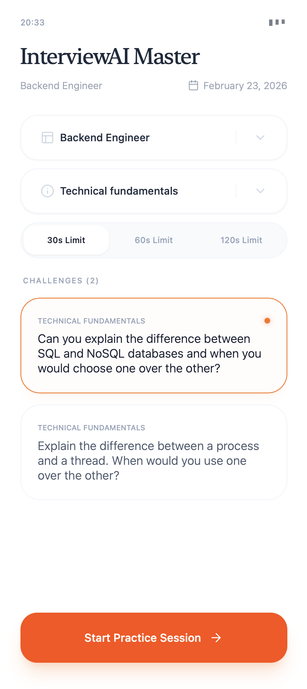
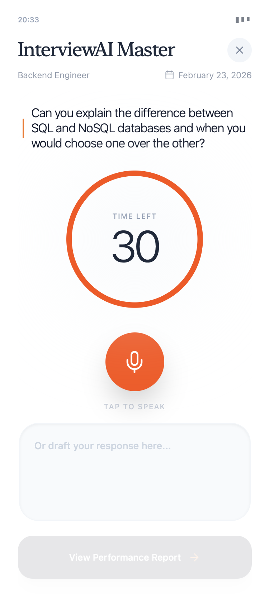
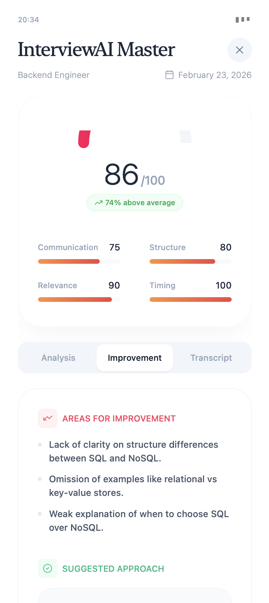
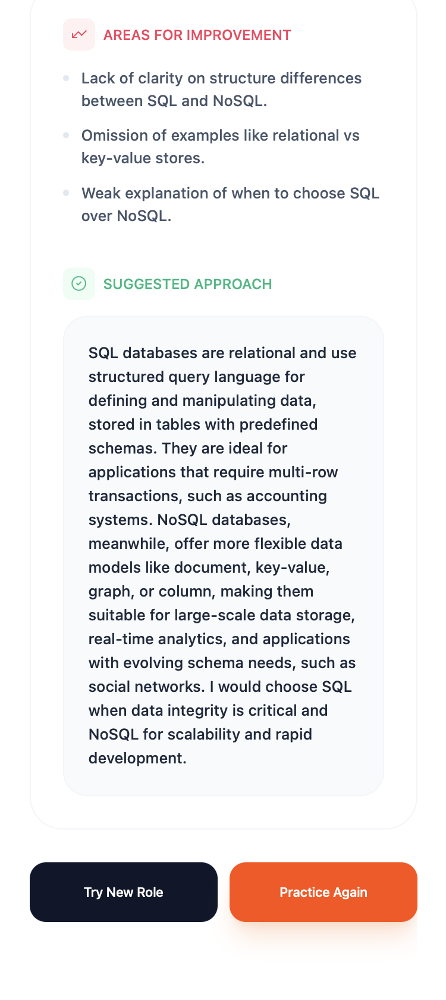
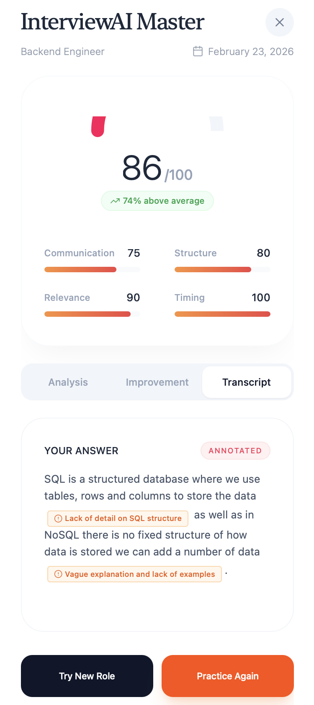

# Interview Questions App

This is a web application that helps users prepare for technical interviews. It displays a variety of questions for different roles and categories.

## Features

- Browse questions by role (Backend, Frontend, Full Stack, etc.)
- Filter questions by type (Technical, Behavioral, etc.)
- Responsive design for use on different devices.

## Screenshots

<table>
  <tr>
    <td></td>
    <td></td>
  </tr>
  <tr>
    <td></td>
    <td></td>
  </tr>
  <tr>
    <td></td>
  </tr>
</table>

## Tech Stack


## Tech Stack

- [Bun](https://bun.sh)
- [React](https://react.dev)
- [Tailwind CSS](https://tailwindcss.com)

## Getting Started

To get a local copy up and running, follow these simple steps.

### Prerequisites

- [Bun](https://bun.sh/docs/installation)

### Installation

1. Clone the repo
   ```sh
   git clone https://github.com/your_username/your_project_name.git
   ```
2. Install BUN packages
   ```sh
   bun install
   ```

### Usage

To start the development server:

```bash
bun dev
```

To run for production:

```bash
bun start
```

